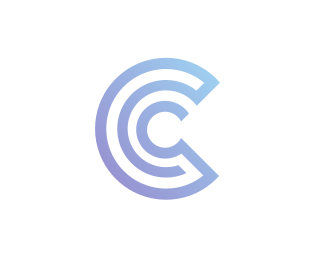

  
   
  <b>A programming language with precision for the web</b>
   
   
  
  
  
  
  
  

A language that tries to copy everything

## Copyrights and License
Copyrights © 2021 The Cassidy Authors

This project is licensed under the GNU GPLv3 License
